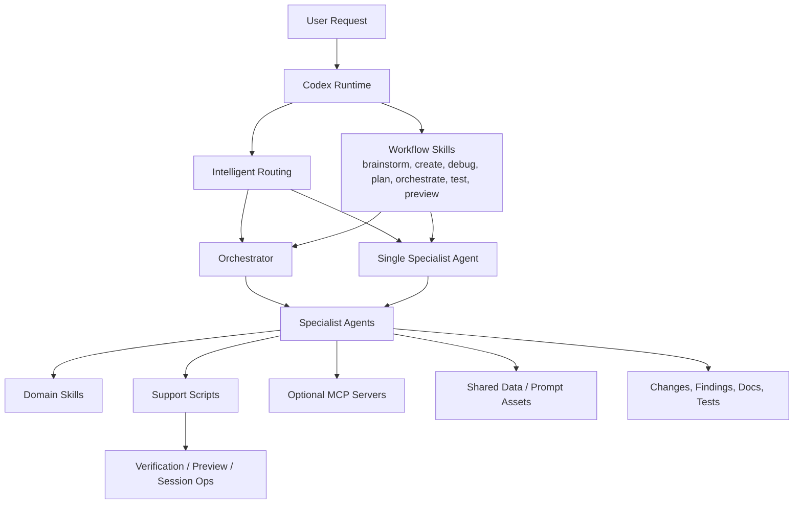
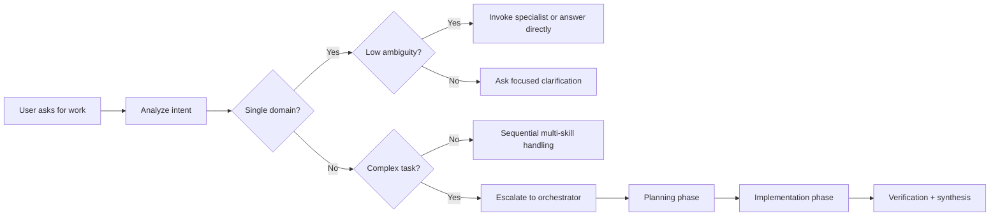
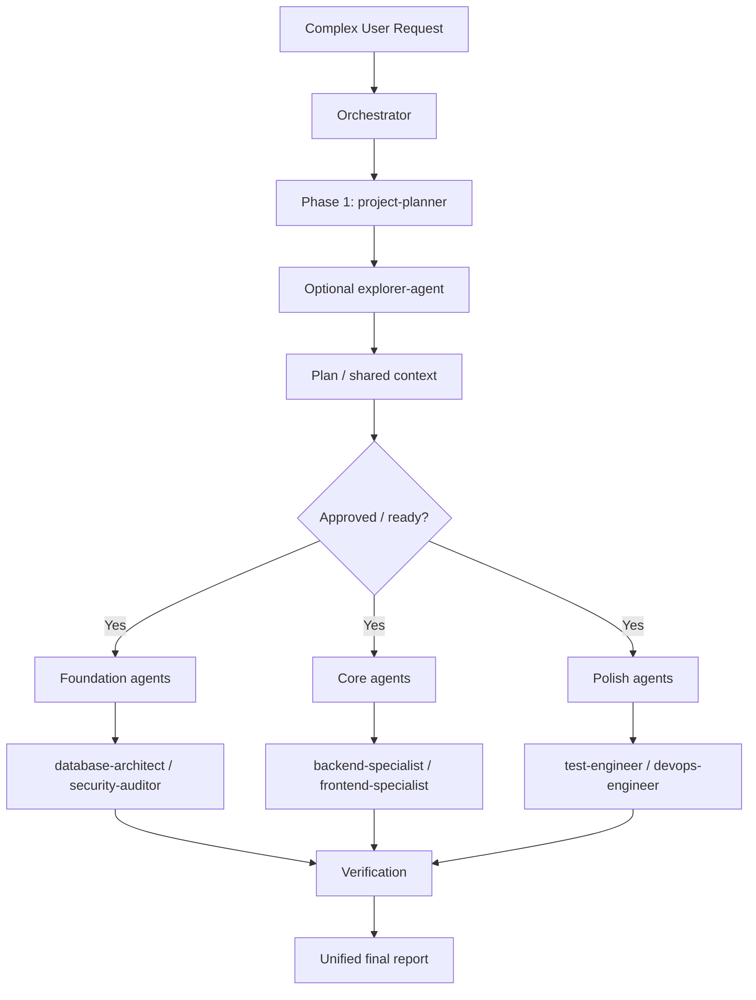
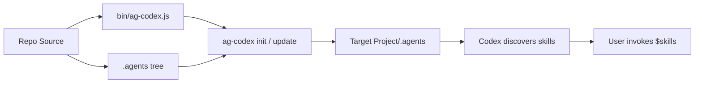

# Agent Flow Architecture

Architecture reference for how `antigravity-codex-bridge` routes requests, invokes skills, coordinates specialist agents, and delivers a portable `.agents` package for Codex.

## Purpose

This repository turns the Antigravity operating style into a Codex-first runtime with four primary layers:

1. `Workflow entrypoints` that interpret the user's intent.
2. `Routing logic` that decides whether the task is simple, multi-domain, or orchestration-worthy.
3. `Specialist agents` that execute within strict domain boundaries.
4. `Support infrastructure` such as scripts, shared datasets, and optional MCP integrations.

The design goal is portability: install one `.agents` tree into any project and let Codex discover the same skills and agent prompts locally.

## Design Goals

- Codex-first interaction through `$skill` invocation, not custom slash commands.
- Portable installation via `ag-codex init`.
- Clear separation between workflow control, domain execution, and tooling support.
- Predictable routing from simple tasks to complex orchestration.
- Safe specialization through agent boundaries and verification steps.

## Non-Goals

- Shipping hidden workspace-specific dependencies to end users.
- Requiring `.agent/` compatibility files in the published package.
- Recreating a proprietary runtime outside Codex's native skill and agent model.

## System Topology



## Layered Architecture

| Layer | Repo Location | Responsibility |
|-------|---------------|----------------|
| CLI installer | `bin/ag-codex.js` | Installs or updates `.agents` into a target project |
| Workflow layer | `.agents/workflows/` | Provides Antigravity-style task entrypoints for Codex |
| Skill layer | `.agents/skills/` | Encodes decision rules, implementation guidance, and domain heuristics |
| Agent layer | `.agents/agents/` | Holds specialist prompts for scoped execution |
| Shared support | `.agents/scripts/`, `.agents/.shared/` | Verification, preview helpers, datasets, and reusable logic |
| Optional local integration | `.agent/`, `.agents/plugins/` | Local-only bridge config and marketplace/plugin compatibility |

## Runtime Components

### 1. Workflow Entrypoints

The workflow layer is the public control surface for users. Typical entrypoints are:

- `$brainstorm`
- `$create`
- `$debug`
- `$deploy`
- `$enhance`
- `$orchestrate`
- `$plan`
- `$preview`
- `$status`
- `$test`
- `$ui-ux-pro-max`

These workflows do not represent separate runtimes. They are Codex-readable prompts that frame how the main model should behave for a task.

### 2. Intelligent Routing

The routing model decides whether a request should:

- stay in the main assistant flow,
- invoke one specialist directly,
- invoke multiple specialists sequentially, or
- escalate to the `orchestrator`.

Routing is driven by:

- detected domain keywords,
- number of domains touched,
- expected complexity,
- ambiguity level,
- file and ownership boundaries.

### 3. Specialist Agents

The specialist layer contains focused execution roles such as:

- `frontend-specialist`
- `backend-specialist`
- `database-architect`
- `security-auditor`
- `test-engineer`
- `devops-engineer`
- `debugger`
- `performance-optimizer`
- `documentation-writer`
- `project-planner`
- `explorer-agent`
- `mobile-developer`

Each agent is expected to stay within its domain rather than behaving like a generalist.

### 4. Support Infrastructure

Support utilities deepen execution without changing the control flow:

- `.agents/scripts/auto_preview.py`
- `.agents/scripts/checklist.py`
- `.agents/scripts/session_manager.py`
- `.agents/scripts/verify_all.py`
- `.agents/.shared/ui-ux-pro-max/` for reusable design reasoning assets
- optional MCP server definitions in `.agent/mcp_config.json`

## Request Lifecycle



## Detailed Flow

### Path A: Simple Request

Used when the task is narrow and belongs to one domain.

Examples:

- Styling a component
- Fixing a backend route
- Writing a test
- Explaining a pattern

Flow:

1. Detect domain.
2. Apply the relevant skill guidance.
3. Invoke or emulate the matching specialist.
4. Make the change or answer directly.
5. Verify with the lightest appropriate check.

### Path B: Moderate Multi-Domain Request

Used when the task touches two related areas but is still reasonably bounded.

Examples:

- Login feature touching backend and security
- Data display touching backend and frontend

Flow:

1. Detect both domains.
2. Sequence agent participation or combine guidance locally.
3. Keep scopes explicit so file ownership stays clear.
4. Verify the combined outcome.

### Path C: Complex Orchestration

Used when the task spans multiple domains, files, or architectural decisions.

This follows the orchestration contract found in the workflow and skill docs:

1. `Phase 1: Planning`
2. `Checkpoint: approval or alignment`
3. `Phase 2: Implementation`
4. `Verification and synthesis`

## Orchestration Architecture



### Orchestration Rules

- Use orchestration only for genuinely complex work.
- Minimum orchestration target is multiple distinct specialists, not a single delegated worker.
- Planning comes before parallel execution.
- Context passed to subagents must include:
  - original user request,
  - decisions already made,
  - current plan state,
  - prior agent output when relevant.

## Boundary Model

The architecture depends on strong domain boundaries. A few important examples:

| Domain | Primary Owner | Typical Files |
|--------|---------------|---------------|
| Frontend | `frontend-specialist` | `components/`, UI logic, styles |
| Backend | `backend-specialist` | `api/`, `server/`, business logic |
| Database | `database-architect` | schema, migrations, query design |
| Testing | `test-engineer` | `__tests__/`, `*.test.*`, mocks |
| Security | `security-auditor` | auth review, vulnerability analysis |
| DevOps | `devops-engineer` | CI/CD, infra, deployment config |
| Docs | `documentation-writer` | README, docs, reference material |

This prevents a frontend-focused flow from quietly taking ownership of backend or test artifacts without intent.

## Packaging and Installation Flow



### Packaging Notes

- `package.json` publishes the CLI plus the portable `.agents` content.
- `bin/ag-codex.js` copies `.agents` into the target project.
- `plugins/antigravity/` and `.agent/` are local compatibility concerns, not core published runtime dependencies.
- The published runtime is intentionally small: prompts, skills, shared assets, and the installer CLI.

## Directory Map

```text
.
|-- .agent/                     # local-only MCP compatibility config
|-- .agents/
|   |-- agents/                # specialist prompts
|   |-- skills/                # domain and workflow instructions
|   |-- workflows/             # user-facing task entrypoints
|   |-- scripts/               # verification and helper scripts
|   |-- .shared/               # reusable datasets and helper code
|   `-- plugins/               # optional local marketplace wiring
|-- bin/ag-codex.js            # installer/update/status CLI
`-- package.json               # published package manifest
```

## Operational Summary

In practice, the architecture behaves like this:

1. The user expresses intent through normal chat or a `$workflow`.
2. Codex analyzes the request and selects the lightest viable execution path.
3. Skills shape behavior and decision-making.
4. Specialist agents execute only within their domain boundaries.
5. Scripts, shared data, and optional MCP integrations provide leverage.
6. Results are synthesized back into one Codex response or one installed `.agents` runtime.

## Recommended Future Extensions

- Add an `ARCHITECTURE.md` link from `README.md` if this document becomes a primary reference.
- Add a versioned diagram for package runtime versus local dev compatibility mode.
- Document which workflows prefer planning-first behavior versus direct execution.
- Add a small matrix mapping each workflow to its default specialist agents.
