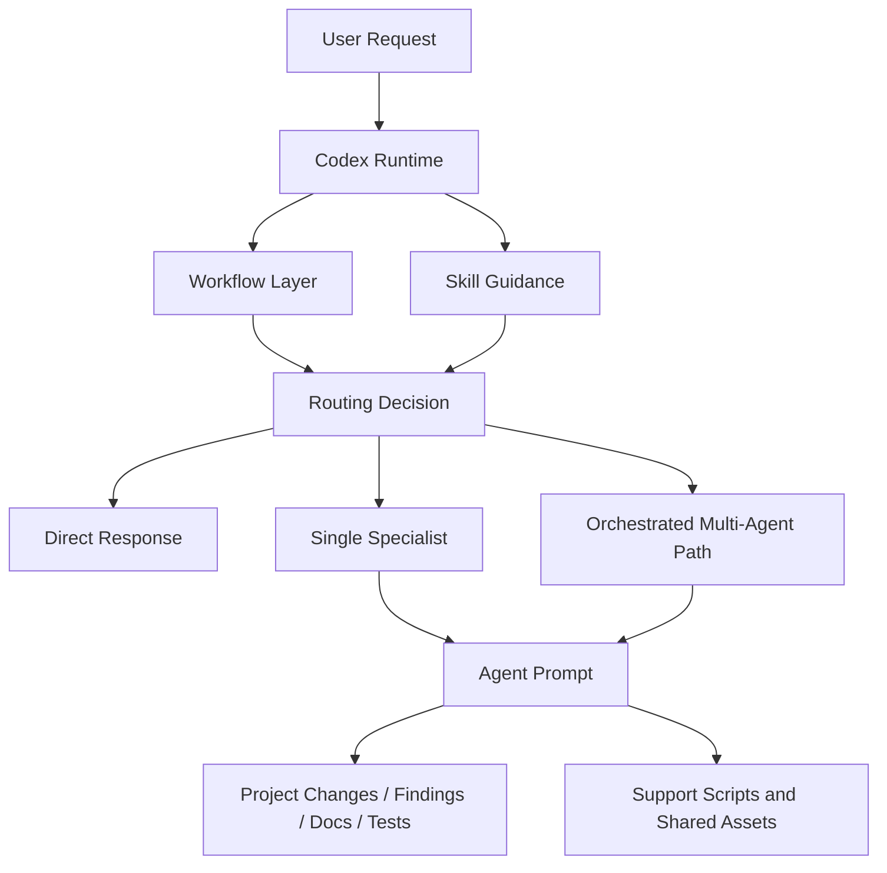
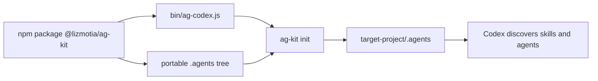
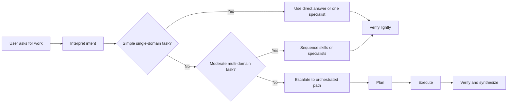

# AG Kit Agent Flow

Architecture reference for how AG Kit installs, exposes, and routes its portable Codex runtime.

## Current Runtime

AG Kit is now shipped as the published npm package:

```bash
@lizmotia/ag-kit
```

Primary install flow:

```bash
npx @lizmotia/ag-kit init
```

Global install flow:

```bash
npm install -g @lizmotia/ag-kit
ag-kit init
```

Recommended refresh flow for projects that already contain `.agents`:

```bash
npx @lizmotia/ag-kit update
```

Equivalent overwrite flow:

```bash
npx @lizmotia/ag-kit init --force
```

Compatibility alias:

```bash
ag-codex init
```

## Purpose

The package exists to install one portable `.agents` tree into any project so Codex can discover the same workflows, specialist agents, and support scripts locally.

The operating model has four layers:

1. Workflow entrypoints that frame user intent.
2. Skill guidance that shapes routing and decisions.
3. Specialist agents that execute within domain boundaries.
4. Shared support assets such as scripts and datasets.

## Design Goals

- Codex-first usage through `$skill` invocation.
- One-command installation through `ag-kit init`.
- Portable project-local runtime rather than repo-specific prompt drift.
- Clear separation between workflows, skills, agents, and support utilities.
- Predictable escalation from simple tasks to multi-agent coordination.

## Non-Goals

- Shipping local compatibility scaffolding that is not needed by end users.
- Depending on custom slash-command runtimes outside Codex.
- Hiding workflow behavior behind opaque packaging.

## Runtime Topology



## Installed Directory Model



## Layer Map

| Layer | Location | Responsibility |
|------|----------|----------------|
| Installer CLI | `bin/ag-codex.js` | Copies or refreshes `.agents` in a target project |
| Workflows | `.agents/workflows/` | Entry prompts such as `brainstorm`, `create`, `debug`, `plan`, and `test` |
| Skills | `.agents/skills/` | Guidance, playbooks, checklists, and domain heuristics |
| Agents | `.agents/agents/` | Specialist execution roles with scoped ownership |
| Shared support | `.agents/scripts/`, `.agents/.shared/` | Verification helpers, reusable data, and support utilities |

## Package Contents

Current portable bundle size:

| Component | Count |
|----------|------:|
| Agents | 20 |
| Skills | 96 |
| Workflows | 11 |
| Scripts | 17 |

## Workflow Layer

The workflow layer is the main user-facing control surface inside Codex.

Typical workflows include:

- `$brainstorm`
- `$create`
- `$debug`
- `$deploy`
- `$enhance`
- `$orchestrate`
- `$plan`
- `$preview`
- `$status`
- `$test`
- `$ui-ux-pro-max`

These workflows do not create a separate runtime. They are prompts and operating rules that steer how Codex handles the task.

## Routing Model

AG Kit assumes a lightweight escalation model:

1. Direct handling for small, single-domain work.
2. Single-specialist handling for bounded domain-specific work.
3. Sequential multi-skill handling for moderate cross-domain work.
4. Orchestrated flow for genuinely complex or multi-owner work.

Routing typically depends on:

- number of domains involved,
- ambiguity level,
- expected file ownership spread,
- risk level,
- need for verification or planning.

## Specialist Agent Model

Specialist prompts are meant to stay within domain boundaries instead of acting as unrestricted generalists.

Examples:

- `frontend-specialist`
- `backend-specialist`
- `database-architect`
- `security-auditor`
- `test-engineer`
- `devops-engineer`
- `debugger`
- `performance-optimizer`
- `documentation-writer`
- `project-planner`
- `explorer-agent`
- `mobile-developer`

## Request Lifecycle



## Orchestrated Path

For larger tasks, the intended flow is:

1. Planning and scoping.
2. Clear ownership boundaries.
3. Parallel or sequential specialist execution.
4. Verification and synthesis.

The goal is not to spawn agents by default. The goal is to use the lightest execution path that still keeps quality and ownership clear.

## Boundary Model

| Domain | Primary Owner | Typical Scope |
|-------|---------------|---------------|
| Frontend | `frontend-specialist` | UI, components, styles, interaction behavior |
| Backend | `backend-specialist` | APIs, services, business logic |
| Database | `database-architect` | schema, migrations, query design |
| Testing | `test-engineer` | test files, mocks, verification strategy |
| Security | `security-auditor` | auth review, risky flows, vulnerability analysis |
| DevOps | `devops-engineer` | CI/CD, deployment, environment setup |
| Docs | `documentation-writer` | README, guides, reference material |

## Installer Behavior

`bin/ag-codex.js` provides the package entrypoint for:

- `ag-kit init`
- `ag-kit update`
- `ag-kit init --force`
- `ag-kit status`
- `ag-kit help`

Behavior summary:

- `init` copies `.agents` into the target project.
- `update` replaces an existing `.agents` installation.
- `status` summarizes whether the installation exists and what it contains.
- `ag-codex` remains available as an alias to the same CLI.

## Published Scope

The npm package is intentionally limited to the portable runtime:

- `.agents/`
- `bin/ag-codex.js`
- `AGENT_FLOW.md`
- `PUBLISHING.md`
- `README.md`
- `README(th).md`
- `LICENSE`
- `package.json`

Local compatibility layers or dev-only files should stay outside the published runtime unless they are required for end users.

## Operational Summary

In practice, AG Kit works like this:

1. Install the package into a target project with one command.
2. Codex discovers `.agents` locally.
3. The user invokes workflows or skills with `$`.
4. Skills and workflows shape behavior.
5. Specialists handle domain-specific work when needed.
6. Support scripts and shared assets improve consistency and verification.

## Related Docs

- [README](./README.md)
- [README(th)](./README(th).md)
- [PUBLISHING](./PUBLISHING.md)
